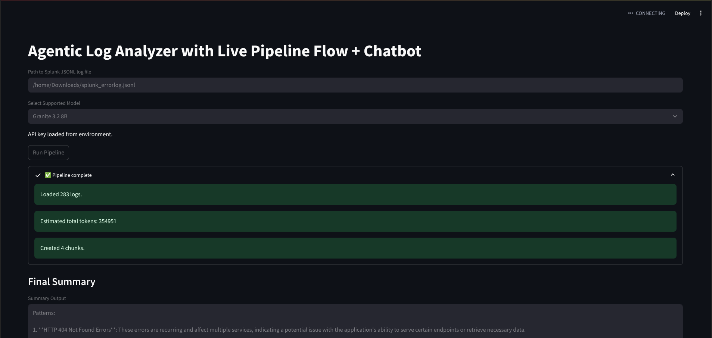
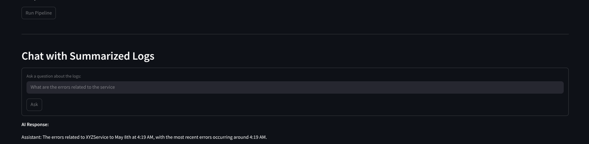

# InsightAgent

**InsightAgent** is a proof-of-concept (PoC) tool designed to assist **SREs**, **Level 1 support**, and **production support** teams by transforming massive volumes of error logs into **actionable summaries**.

Built with **open-source tools** and **AI models**, it enables teams to:
- Triage production issues faster
- Generate Jira-ready descriptions
- Interact with logs using a chatbot interface

## What Problem This Solves

Traditional log analysis often requires:
- Manually sifting through hundreds of log lines
- Parsing gigabytes of noisy or unstructured data
- Identifying known patterns or anomalies without context

## **InsightAgent** features automates and augments this process by:
- Token-aware log chunking
- Per-chunk summarization with local LLMs
- Final synthesized summary generation
- Optional chatbot for Q&A with logs
- Structured summary
- Known solution matching (future)
- Multi-log source support (future)

## Architecture Overview


## InsightAgent log summarization UI


## Chat with Logs


## Getting Started

### Prerequisites
Python 3.13

### Installation

```bash
git clone
cd insight-agent
pip install -r requirements.txt
```

Create `.env` file add
```
MODEL_GRANITE_3_1_8B_ID=</data/xyz>
MODEL_GRANITE_3_1_8B_API=<https://xyz.com>
MODEL_GRANITE_3_1_8B_API_KEY=<Token>
```

## Running the App

### Launch the Streamlit UI:
```bash
streamlit run trace_insight_agent.py
```


## How It Works
**Temperature** is set to `0.3` to ensure a balance of creativity and determinism in AI outputs.
Only key fields like `_time`, `host`, `message`, `traceId` are used to reduce token usage.
Summaries are generated for each chunk and combined to produce a final overview.

## Future Roadmap
- Vector-based retrieval from solution docs
- Multi-log source input
- Real-time streaming log summarization
- Export summaries to Jira
